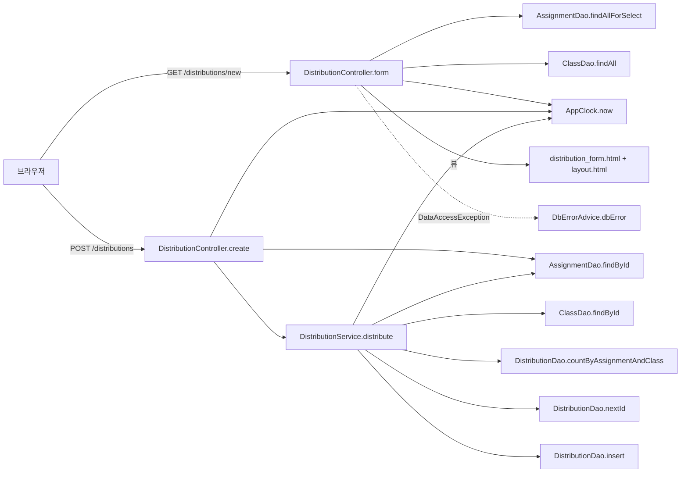

# 과제 배포(assignment) 아키텍처 — 배포 등록 화면

> 분석 대상: `legacy/assignment-thymeleaf` · 범위: **배포 등록 화면**(`GET /distributions/new` + 그 폼의 제출 `POST /distributions`)과 그 화면이 부르는 코드 · 근거 경로는 저장소 맨 위 기준
>
> 약칭: `P` = `legacy/assignment-thymeleaf/src/main/java/com/example/assign`

## 화면을 고른 이유

- 배포 관련 화면은 3개다: 배포 목록(`GET /distributions`), 배포 등록(`GET /distributions/new`), 재배포(`POST /distributions/{id}/redistribute`) (`P/web/DistributionController.java:32`, `:40`, `:79`).
- 배포 등록은 "과제를 학급에 배포한다"는 이 모듈의 기본 동작이고, 호출 경로가 서비스 메서드 1개(`distribute`, 22줄)로 짧아 범위를 좁히기 좋다. 재배포(`redistribute`)는 `DistributionService.java:72` 에서 시작하고 이 파일은 701줄이라(본문은 범위 밖이라 읽지 않음) 한 화면 범위로는 크다.

## 모듈 개요

- Spring Boot + Thymeleaf + `JdbcTemplate` DAO 로 만든 서버 렌더링 앱이다. Controller → Service → DAO 3계층이다 (`P/web/DistributionController.java:22-24`, `P/service/DistributionService.java:28-30`).
- 배포 등록 화면은 **컨트롤러가 DAO 를 직접 부른다**(과제 · 학급 목록, 과제 조회). 서비스를 거치는 것은 저장(`distribute`)뿐이다 (`P/web/DistributionController.java:42-43`, `:53`, `:67`).
- 현재 시각은 `AppClock.now()` 로 얻고, 기본값은 `2026-09-15 00:00:00` 고정이다 (`P/AppClock.java:9`, `:14-20`).
- DB 는 문항 은행과 같은 MariaDB `itembank` 를 쓴다 (`legacy/assignment-thymeleaf/src/main/resources/application.properties:2`, `db/mariadb/init/01-schema.sql:73`).

## 폴더 구조 (범위 안 파일만 표시)

```
legacy/assignment-thymeleaf/src/main/
├── java/com/example/assign/
│   ├── AppClock.java                 고정 시각 · 날짜 형식
│   ├── web/DistributionController.java   form · create (범위 안), list · redistribute (범위 밖)
│   ├── web/DbErrorAdvice.java        DataAccessException → db_error 화면
│   ├── service/DistributionService.java  distribute (:46-68) 만 범위 안
│   ├── dao/AssignmentDao.java        findAllForSelect · findById
│   ├── dao/ClassDao.java             findAll · findById
│   ├── dao/DistributionDao.java      countByAssignmentAndClass · nextId · insert
│   └── model/AssignmentRow.java, ClassRow.java
└── resources/
    ├── templates/distribution_form.html, layout.html
    └── application.properties
```

- 범위 밖(읽지 않음): `AssignmentController`, `assignments.html`, `distributions.html`, `DistributionService.redistribute` 본문(`:72-`), `DistributionDao.findAllForList` · `markRedistributed` · `findSubmissions`, `model/DistributionRow` · `RedistributeResult` · `SubmissionRow`, `src/test`, gradle wrapper.

## 진입점 표

| URL / 화면 | 처음 실행되는 파일 · 메서드 | 그 메서드가 부르는 주요 함수 |
|---|---|---|
| `GET /distributions/new` — 새 배포 폼 | `DistributionController.form` — `P/web/DistributionController.java:40-47` | `AssignmentDao.findAllForSelect` (`:42`), `ClassDao.findAll` (`:43`), `AppClock.now` (`:44`), 뷰 `distribution_form` (`:46`) |
| `POST /distributions` — 폼 제출(배포) | `DistributionController.create` — `P/web/DistributionController.java:49-77` | `AssignmentDao.findById` (`:53`), `AppClock.now` (`:58`), `AppClock.fmt` (`:62`), `DistributionService.distribute` (`:67`) |

- 폼은 `assignmentId` · `classId` 두 값을 `POST /distributions` 로 보낸다 (`legacy/assignment-thymeleaf/src/main/resources/templates/distribution_form.html:8`, `:11`, `:23`).
- 성공하면 배포 목록(`/distributions`, 범위 밖)으로, 실패하면 폼으로 리다이렉트한다 (`P/web/DistributionController.java:56`, `:63`, `:71`, `:74`, `:76`).

## 의존 관계



### 호출 표

| A → B (A가 B를 호출) | 근거 |
|---|---|
| `DistributionController.form` → `AssignmentDao.findAllForSelect` | `P/web/DistributionController.java:42` |
| `DistributionController.form` → `ClassDao.findAll` | `P/web/DistributionController.java:43` |
| `DistributionController.form` → `AppClock.now` | `P/web/DistributionController.java:44` |
| `DistributionController.create` → `AssignmentDao.findById` | `P/web/DistributionController.java:53` |
| `DistributionController.create` → `AppClock.now` · `AppClock.fmt` | `P/web/DistributionController.java:58`, `:62` |
| `DistributionController.create` → `DistributionService.distribute` | `P/web/DistributionController.java:67` |
| `DistributionService.distribute` → `AssignmentDao.findById` | `P/service/DistributionService.java:48` |
| `DistributionService.distribute` → `ClassDao.findById` | `P/service/DistributionService.java:52` |
| `DistributionService.distribute` → `DistributionDao.countByAssignmentAndClass` | `P/service/DistributionService.java:59` |
| `DistributionService.distribute` → `DistributionDao.nextId` | `P/service/DistributionService.java:62` |
| `DistributionService.distribute` → `DistributionDao.insert` · `AppClock.now` | `P/service/DistributionService.java:63` |
| `AssignmentDao.*` → `JdbcTemplate.query` (`assignment` ⟕ `unit`, `distribution` 부질의) | `P/dao/AssignmentDao.java:21-24`, `:38`, `:43` |
| `ClassDao.*` → `JdbcTemplate.query` (`class`) | `P/dao/ClassDao.java:21`, `:25` |
| `DistributionDao.*` → `JdbcTemplate.queryForObject` · `update` (`distribution`) | `P/dao/DistributionDao.java:48-50`, `:55`, `:60-62` |
| `DbErrorAdvice.dbError` ← 컨트롤러 밖으로 나온 `DataAccessException` (Spring 이 호출) | `P/web/DbErrorAdvice.java:11-12` |
| 앱 → MariaDB 접속 (URL · 계정 · 풀) | `legacy/assignment-thymeleaf/src/main/resources/application.properties:2-8` |

### 설정 의존

- 접속 정보는 `SPRING_DATASOURCE_URL` · `_USERNAME` · `_PASSWORD` 로 받고 compose 가 이 이름으로 넘긴다 (`legacy/assignment-thymeleaf/src/main/resources/application.properties:2-4`, `docker-compose.yml:61-63`). 호스트 포트는 8082 다 (`docker-compose.yml:54`).
- Hikari 최대 4개 · 대기 5초 · DB 없이도 기동 (`legacy/assignment-thymeleaf/src/main/resources/application.properties:6-8`).
- 시각은 JVM 시스템 속성 `app.clock=system` 일 때만 실제 시각이다 (`P/AppClock.java:15-17`). 이 값을 넣는 설정은 범위 안 파일에 없다.
- 트랜잭션은 `distribute` 에만 있다(`P/service/DistributionService.java:46`). 컨트롤러의 과제 조회 · 마감 확인은 트랜잭션 밖이다.

## 가장 긴 함수 3개 (범위 안)

| 순위 | 파일 | 함수 | 라인 | 하는 일 |
|---|---|---|---|---|
| 1 | `P/web/DistributionController.java` | `create` | 49-77 (29줄) | 과제 존재 · 마감 확인 뒤 `distribute` 를 부르고 결과를 flash 메시지로 바꿔 리다이렉트 |
| 2 | `P/service/DistributionService.java` | `distribute` | 46-68 (23줄) | 과제 · 학급 존재, 삭제 상태, 중복 배포를 확인하고 새 id 로 배포 행을 넣는다 |
| 3 | `P/dao/AssignmentDao.java` | `MAPPER.mapRow` | 52-64 (13줄) | 과제 행을 `AssignmentRow` 로 옮긴다(`due_at` NULL 이면 null) |

## 미확인 목록

- `app.clock=system` 을 운영에서 넣는지: Dockerfile · 실행 스크립트는 범위 밖이라 읽지 않았다.
- `assignmentId` · `classId` 에 빈 값이나 숫자가 아닌 값이 오면 어떤 화면이 나오는지: `long` 변환 실패는 Spring 기본 처리에 맡겨져 있고 코드에 처리가 없다 (`P/web/DistributionController.java:50-51`). 실행해 보지 않았다.
- 배포 목록 화면(`/distributions`)이 성공 메시지를 어떻게 보이는지: 범위 밖.
- 재배포(`redistribute`)가 이 화면에서 만든 행을 어떻게 바꾸는지: 범위 밖.
