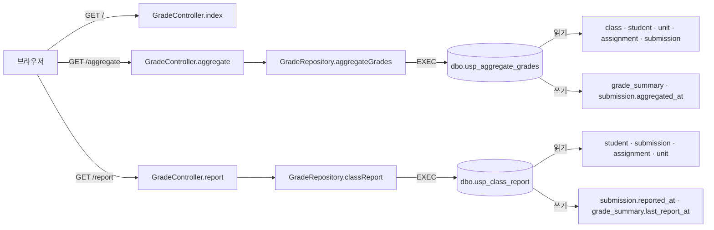

# 성적 집계(grade) 아키텍처

> 분석 대상: `legacy/grade-mssql` · 범위: 진입점과 의존 관계 · 근거 경로는 저장소 맨 위 기준

## 모듈 개요

- Spring Boot 3.3.5 · Java 21 로 만든 얇은 HTTP 호출부 + MS-SQL 저장 프로시저 2개로 이루어진다 (`legacy/grade-mssql/build.gradle.kts:3`, `legacy/grade-mssql/build.gradle.kts:12`).
- 비즈니스 규칙은 전부 저장 프로시저에 있고, Java 는 프로시저를 호출해 결과 행을 HTML 표로 보여주기만 한다 (`legacy/grade-mssql/src/main/java/com/example/grade/GradeApplication.java:7-9`).
- Java 클래스는 3개(Application · Controller · Repository)이고 서비스 계층이 없다. Controller 가 Repository 를 직접 부른다 (`legacy/grade-mssql/src/main/java/com/example/grade/GradeController.java:25-29`).
- 화면은 템플릿 엔진 없이 컨트롤러가 문자열로 HTML 을 조립한다 (`legacy/grade-mssql/src/main/java/com/example/grade/GradeController.java:90-125`).
- 조회 화면(GET)이지만 두 프로시저 모두 DB 에 쓴다 (`legacy/grade-mssql/sql/usp_aggregate_grades.sql:8`, `legacy/grade-mssql/sql/usp_class_report.sql:8`).

## 폴더 구조

```
legacy/grade-mssql/
├── build.gradle.kts                      의존성: web · jdbc · mssql-jdbc (:20-25)
├── Dockerfile                            gradle 빌드 → JRE 실행, GRADES_JDBC_URL 지정 (:11)
├── sql/
│   ├── usp_aggregate_grades.sql          437줄. 학급 성적 집계 프로시저
│   └── usp_class_report.sql              198줄. 학급 단원별 현황 프로시저
├── src/main/java/com/example/grade/
│   ├── GradeApplication.java             main (:14-16)
│   ├── GradeController.java              URL 3개 + HTML 조립 헬퍼
│   └── GradeRepository.java              EXEC 호출 2개 + ResultSet → Map 변환
├── src/main/resources/application.properties   DB 접속 · Hikari 설정
└── gradle/, gradlew, gradlew.bat         Gradle wrapper (분석 제외)
```

- 테스트 폴더(`src/test`)는 없다. `testImplementation` 의존성만 선언돼 있다 (`legacy/grade-mssql/build.gradle.kts:24`).
- `sql/` 은 컨테이너에서 실제로 쓰는 `db/mssql/init/04-procs.sql` 의 사본이다 (`legacy/grade-mssql/sql/usp_aggregate_grades.sql:10-11`). 주석 줄을 뺀 두 파일의 프로시저 본문은 같고, `04-procs.sql` 끝에 `GRANT EXECUTE` 두 줄이 더 있다 (`db/mssql/init/04-procs.sql:648-649`).

## 진입점 표

| URL / 화면 | 처음 실행되는 파일 · 메서드 | 그 메서드가 부르는 주요 함수 |
|---|---|---|
| (앱 기동) | `GradeApplication.main` — `legacy/grade-mssql/src/main/java/com/example/grade/GradeApplication.java:14-16` | `SpringApplication.run` (`:15`) |
| `GET /` — 안내 화면 | `GradeController.index` — `legacy/grade-mssql/src/main/java/com/example/grade/GradeController.java:31-44` | `head` (`:34`), `foot` (`:42`). DB 호출 없음 |
| `GET /aggregate?class_id=` — 성적 집계 표 `<table id="grades">` | `GradeController.aggregate` — `legacy/grade-mssql/src/main/java/com/example/grade/GradeController.java:46-60` | `normalize` (`:48`), `GradeRepository.aggregateGrades` (`:50`), `head` · `esc` · `table` · `foot` (`:51-55`), 실패 시 `error` (`:58`) |
| `GET /report?class_id=` — 학급 단원별 현황 표 `<table id="report">` | `GradeController.report` — `legacy/grade-mssql/src/main/java/com/example/grade/GradeController.java:62-79` | `normalize` (`:64`), `GradeRepository.classReport` (`:66`), `head` · `esc` · `table` · `foot` (`:67-74`), 실패 시 `error` (`:77`) |

- `class_id` 가 없거나 공백이면 `C1` 을 쓴다 (`legacy/grade-mssql/src/main/java/com/example/grade/GradeController.java:23`, `:83-88`).
- DB 오류(`DataAccessException`)는 502 와 오류 HTML 로 바뀐다 (`legacy/grade-mssql/src/main/java/com/example/grade/GradeController.java:108-114`).
- 안내 화면은 학급 `C1, C2, C3` 를 안내한다 (`legacy/grade-mssql/src/main/java/com/example/grade/GradeController.java:41`).

## 의존 관계



### 호출 표

| A → B (A가 B를 호출) | 근거 |
|---|---|
| `GradeApplication.main` → `SpringApplication.run` | `legacy/grade-mssql/src/main/java/com/example/grade/GradeApplication.java:15` |
| `GradeController` → `GradeRepository` (생성자 주입) | `legacy/grade-mssql/src/main/java/com/example/grade/GradeController.java:25-29` |
| `GradeController.aggregate` → `GradeRepository.aggregateGrades` | `legacy/grade-mssql/src/main/java/com/example/grade/GradeController.java:50` |
| `GradeController.report` → `GradeRepository.classReport` | `legacy/grade-mssql/src/main/java/com/example/grade/GradeController.java:66` |
| `GradeController.aggregate` · `report` → `table` → `esc` | `legacy/grade-mssql/src/main/java/com/example/grade/GradeController.java:54`, `:70`, `:94`, `:100` |
| `GradeController.aggregate` · `report` → `error` | `legacy/grade-mssql/src/main/java/com/example/grade/GradeController.java:58`, `:77` |
| `GradeRepository` → `JdbcTemplate` (생성자 주입) | `legacy/grade-mssql/src/main/java/com/example/grade/GradeRepository.java:17-21` |
| `GradeRepository.aggregateGrades` → `EXEC dbo.usp_aggregate_grades @class_id = ?` | `legacy/grade-mssql/src/main/java/com/example/grade/GradeRepository.java:25` |
| `GradeRepository.classReport` → `EXEC dbo.usp_class_report @class_id = ?` | `legacy/grade-mssql/src/main/java/com/example/grade/GradeRepository.java:30` |
| `GradeRepository.rowToMap` → `format` (DECIMAL 은 `toPlainString`) | `legacy/grade-mssql/src/main/java/com/example/grade/GradeRepository.java:39`, `:49-51` |
| `usp_aggregate_grades` → 읽기 `dbo.class` · `dbo.student` · `dbo.unit` · `dbo.assignment` · `dbo.submission` | `legacy/grade-mssql/sql/usp_aggregate_grades.sql:39-41`, `:96-100`, `:104-109`, `:127` |
| `usp_aggregate_grades` → 쓰기 `dbo.grade_summary` (UPDATE · INSERT · DELETE) | `legacy/grade-mssql/sql/usp_aggregate_grades.sql:333-367` |
| `usp_aggregate_grades` → 쓰기 `dbo.submission.aggregated_at` | `legacy/grade-mssql/sql/usp_aggregate_grades.sql:409-413` |
| `usp_class_report` → 읽기 `dbo.student` · `dbo.submission` · `dbo.assignment` · `dbo.unit` | `legacy/grade-mssql/sql/usp_class_report.sql:33-35`, `:85-92`, `:134`, `:147-153` |
| `usp_class_report` → 쓰기 `dbo.submission.reported_at` · `dbo.grade_summary.last_report_at` | `legacy/grade-mssql/sql/usp_class_report.sql:164-175` |
| 앱 → MS-SQL 접속 (URL · 계정 · 풀) | `legacy/grade-mssql/src/main/resources/application.properties:5-13` |

### 설정 의존

- JDBC URL 은 `GRADES_JDBC_URL` 환경변수로 받고, 컨테이너에서는 Dockerfile 이 `mssql:1433` 으로 지정한다 (`legacy/grade-mssql/src/main/resources/application.properties:5`, `legacy/grade-mssql/Dockerfile:11`).
- 계정은 `GRADES_DB_USER` · `GRADES_DB_PASSWORD` 를 읽고, 없으면 `app` 계정을 쓴다 (`legacy/grade-mssql/src/main/resources/application.properties:6-7`). compose 는 `DB_USER: sa` · `DB_PASS` 를 넘기지만 앱은 이 이름을 읽지 않는다 (`docker-compose.yml:86-90`). 그래서 실제로는 `app` 계정으로 접속하고, 이 계정은 `db_owner` 역할이다 (`db/mssql/init/03-users.sql:24`).
- Hikari 최대 3개 · 대기 5초 · DB 가 없어도 앱은 기동한다 (`legacy/grade-mssql/src/main/resources/application.properties:11-13`).
- 두 프로시저는 잠금 순서가 서로 반대다. 집계는 grade_summary → submission, 보고는 submission → grade_summary 순서로 잠근다 (`legacy/grade-mssql/sql/usp_aggregate_grades.sql:327-328`, `legacy/grade-mssql/sql/usp_class_report.sql:158-159`).

## 가장 긴 함수 3개

| 순위 | 파일 | 함수 | 라인 | 하는 일 |
|---|---|---|---|---|
| 1 | `legacy/grade-mssql/sql/usp_aggregate_grades.sql` | `dbo.usp_aggregate_grades` | 23-437 (415줄) | 학급 학생×단원 점수를 커서로 계산해 `grade_summary` 에 저장하고, 단원별 행과 TOTAL 행을 돌려준다 |
| 2 | `legacy/grade-mssql/sql/usp_class_report.sql` | `dbo.usp_class_report` | 23-198 (176줄) | 학급의 단원별 제출 · 미제출 · 지연 · 제외 수와 평균 · 최고 · 최저 점수를 돌려주고, 보고 시각을 기록한다 |
| 3 | `legacy/grade-mssql/src/main/java/com/example/grade/GradeController.java` | `report` | 62-79 (18줄) | `classReport` 결과를 `<table id="report">` HTML 로 조립한다 |

## 미확인 목록

- 테이블 스키마(컬럼 타입 · 키 · 인덱스): `db/mssql/init/01-schema.sql` 을 열지 않았다.
- 시드 데이터(학급 C1~C3 의 학생 · 제출 건수): `db/mssql/init/02-seed.sql` 을 열지 않았다.
- 실행 중인 컨테이너 DB 의 프로시저가 `04-procs.sql` 과 같은지: DB 에 접속해 조회하지 않았다.
- compose 의 `DB_USER` · `DB_PASS` 를 앱이 읽지 않는 것이 의도인지: 코드와 설정에 근거가 없다.
- 집계와 보고를 동시에 호출하면 잠금 순서가 반대라 교착이 생기는지: 실제로 재현해 보지 않았다.
- 비즈니스 규칙(지연 감점 · 등급 · 가중치 · 반올림)의 세부: 이번 범위(진입점 · 의존 관계) 밖이라 다음 단계에서 분석한다.
