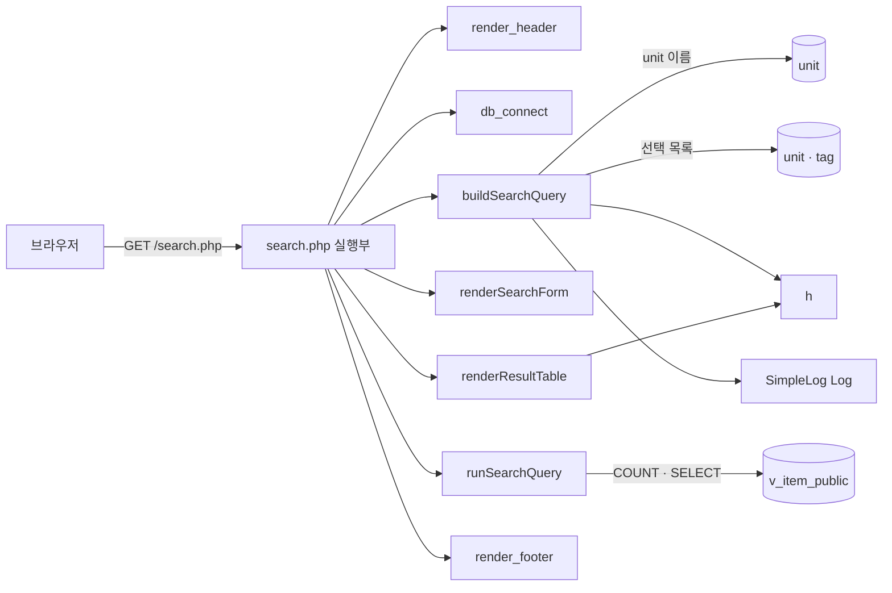

# 문항 은행(item-bank) 아키텍처 — 문항 검색 화면

> 분석 대상: `legacy/item-bank-php` · 범위: **문항 검색 화면**(`GET /search.php`)과 그 화면이 부르는 코드 · 근거 경로는 저장소 맨 위 기준
>
> 약칭: `S` = `legacy/item-bank-php/search.php`

## 화면을 고른 이유

- 모듈의 화면은 검색 · 등록 · 단원 목록 3개다 (`legacy/item-bank-php/inc/layout.php:9-13`).
- 검색은 조회 동작이고(데이터를 바꾸지 않음) 파라미터 7개에 규칙이 몰려 있어 Day 1-3 동작 보존 테스트 대상으로 알맞다. `characterization/README.md` 의 예시도 `/search.php` 다.
- 범위 밖(읽지 않음): `register.php`, `units.php`, `index.php`, `vendor/simplelog` 본문(로그 수준 상수만 확인).

## 모듈 개요

- PHP 7.4 + Apache 단일 파일 화면이다. 프레임워크 · 템플릿 없이 `echo` 로 HTML 을 만든다 (`legacy/item-bank-php/Dockerfile:1`, `S:709-731`).
- 검색 화면은 함수 4개(조건 조립 · 실행 · 폼 출력 · 표 출력)와 맨 아래 실행부로 이루어진다 (`S:42`, `:571`, `:629`, `:647`, `:709-731`).
- DB 는 mysqli 로 MariaDB `itembank` 에 붙고, 공개 문항 뷰 `v_item_public` 을 기준으로 조회한다 (`legacy/item-bank-php/inc/db.php:14-21`, `S:519-522`).
- 모든 조회는 prepared statement 바인딩을 쓴다. 정렬 · LIMIT 만 문자열로 붙이며 둘 다 화이트리스트 · 정수다 (`S:276-327`, `:523`, `:586`).

## 폴더 구조 (범위 안 파일만)

```
legacy/item-bank-php/
├── search.php          731줄. 문항 검색 화면 전체
├── inc/db.php          db_connect() · h() (HTML 이스케이프)
├── inc/layout.php      render_header() · render_footer()
├── vendor/simplelog/   외부 로그 라이브러리 (분석 제외)
└── Dockerfile          php:7.4-apache
```

## 진입점 표

| URL / 화면 | 처음 실행되는 파일 · 메서드 | 그 메서드가 부르는 주요 함수 |
|---|---|---|
| `GET /search.php?q=&unit=&level=&tag=&sort=&dir=&page=` — 문항 검색 | `search.php` 실행부 — `S:709-731` | `render_header` (`:709`), `db_connect` (`:713`), `buildSearchQuery` (`:722`), `renderSearchForm` (`:723`), `runSearchQuery` (`:724`), `renderResultTable` (`:725`), `render_footer` (`:731`) |

- 파라미터 목록은 파일 머리 주석에 있다 (`S:5-12`). 배열로 들어오면 첫 값만 쓴다 (`S:51-80`).
- DB 연결 실패는 오류 문구를 찍고 끝낸다(`S:714-718`). 검색 중 `RuntimeException` 은 "검색 중 오류가 발생했습니다." 를 찍는다(`S:726-729`). 두 경우 모두 HTTP 상태 코드를 바꾸는 코드는 없다.

## 의존 관계



### 호출 표

| A → B (A가 B를 호출) | 근거 |
|---|---|
| 실행부 → `render_header('문항 검색', 'search')` | `S:709` |
| 실행부 → `db_connect` | `S:713` |
| 실행부 → `buildSearchQuery($_GET, $conn)` | `S:722` |
| 실행부 → `renderSearchForm` | `S:723` |
| 실행부 → `runSearchQuery` | `S:724` |
| 실행부 → `renderResultTable` | `S:725` |
| 실행부 → `render_footer` | `S:717`, `:731` |
| `buildSearchQuery` → `unit` 이름 조회 (`SELECT name, grade FROM unit WHERE code = ?`) | `S:125` |
| `buildSearchQuery` → 선택 목록 조회 `unit` · `tag` | `S:156`, `:178` |
| `buildSearchQuery` → `h` (요약 · 경고 · 폼 HTML) | `S:360`, `:513`, `:494` |
| `buildSearchQuery` → `Log::debug` · `Log::error` | `S:103`, `:528`, `:537` |
| `runSearchQuery` → `mysqli::prepare` · `bind_param` · `execute` (건수, 행) | `S:577-597`, `:600-621` |
| `renderResultTable` → `h` | `S:674-678` |
| `render_header` → `h` | `legacy/item-bank-php/inc/layout.php:17`, `:33` |

### 설정 의존

- 접속 정보는 `DB_HOST` · `DB_PORT` · `DB_NAME` · `DB_USER` · `DB_PASS` 환경 변수, 없으면 `mariadb:3306/itembank`, `app`/`app-pass` (`legacy/item-bank-php/inc/db.php:14-18`). compose 가 같은 이름으로 넘긴다(`docker-compose.yml:40-45`). 호스트 포트 8081 (`docker-compose.yml:39`).
- 로그 임계값은 INFO 라서 `Log::debug` 는 기록되지 않는다 (`S:27`, `legacy/item-bank-php/vendor/simplelog/Log.php:11-12`).

## 가장 긴 함수 3개 (범위 안)

| 순위 | 파일 | 함수 | 라인 | 하는 일 |
|---|---|---|---|---|
| 1 | `S` | `buildSearchQuery` | 42-564 (523줄) | 파라미터 7개를 검증 · 보정해 WHERE · ORDER BY · LIMIT, 경고 · 요약 · 폼 · 정렬 링크 HTML 을 만든다 |
| 2 | `S` | `renderResultTable` | 647-704 (58줄) | 경고 · 요약 · 건수 · 결과 표 · 페이지 링크를 찍는다 |
| 3 | `S` | `runSearchQuery` | 571-624 (54줄) | 건수 쿼리와 현재 페이지 쿼리를 바인딩해 실행한다 |

## 미확인 목록

- DB 오류 · 연결 실패 때 HTTP 상태 코드: 코드에 설정이 없어 PHP 기본(200)일 것으로 보이나 실행해 보지 않았다.
- `vendor/simplelog` 가 로그를 어디에 쓰는지: 범위 밖.
- `register.php` 가 `v_item_public` 을 어떻게 쓰는지(스키마 주석 `db/mariadb/init/01-schema.sql:51`): 범위 밖.
