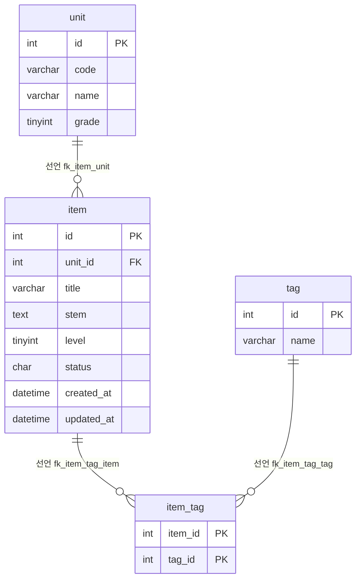

# 문항 은행(item-bank) 데이터 흐름 · ERD — 문항 검색 화면

> 분석 대상: `legacy/item-bank-php` · 범위: 문항 검색 화면(`GET /search.php`) · 선행 문서: `docs/item-bank/ARCHITECTURE.md` · 근거 경로는 저장소 맨 위 기준
>
> 약칭: `S` = `legacy/item-bank-php/search.php`, `SCH` = `db/mariadb/init/01-schema.sql`

## 테이블 목록 (이 화면이 닿는 것만)

| 테이블 · 뷰 | 주요 컬럼 | 키 · 제약 | 근거 |
|---|---|---|---|
| `unit` | `id` INT, `code` VARCHAR(16), `name`, `grade` TINYINT | PK `id`, UNIQUE `code` | `SCH:11-18` |
| `item` | `id`, `unit_id`, `title` VARCHAR(200), `stem` TEXT, `level` TINYINT, `status` CHAR(1) 기본 `'A'`, `created_at`, `updated_at` | PK `id`, FK `unit_id → unit.id`, 인덱스 `unit_id` · `level` | `SCH:20-33` |
| `tag` | `id`, `name` VARCHAR(50) | PK `id`, UNIQUE `name` | `SCH:35-40` |
| `item_tag` | `item_id`, `tag_id` | PK `(item_id, tag_id)`, FK 2개 | `SCH:42-48` |
| 뷰 `v_item_public` | `id, unit_id, unit_code, unit_name, unit_grade, title, stem, level, created_at, updated_at, tag_names` | `item ⋈ unit`, `status = 'A'` 만, `tag_names` 는 태그 id 순 쉼표 연결 | `SCH:52-70` |

- 모든 테이블 정렬 규칙(collation)은 `utf8mb4_unicode_ci`(대소문자 무시)다 (`SCH:18`, `:33`, `:40`, `:48`).

## 테이블 관계



| 관계 | 구분 | 근거 |
|---|---|---|
| `item.unit_id → unit.id` | 선언 | `SCH:32` |
| `item_tag.item_id → item.id` | 선언 | `SCH:46` |
| `item_tag.tag_id → tag.id` | 선언 | `SCH:47` |
| 검색의 `unit` 파라미터 ↔ `unit.code` | 추정(코드 조인) | 뷰가 `u.code AS unit_code` 로 노출, 검색은 `unit_code = ?` (`SCH:56`, `S:118`) |

## 데이터 흐름

```
GET /search.php
  → buildSearchQuery
      unit (코드 → 이름·학년, 요약용)           S:125
      unit 전체 (단원 select, 학년·코드 순)      S:156
      tag 전체 (태그 select, id 순)              S:178
      → WHERE · ORDER BY · LIMIT 조립            S:44-349, :521-526
  → runSearchQuery
      v_item_public COUNT(*)  (같은 WHERE)       S:526, :577-597
      v_item_public SELECT … LIMIT 20 OFFSET n   S:525, :600-621
  → renderResultTable (건수 · 표 · 페이지 링크)
```

- 건수 쿼리와 행 쿼리는 같은 WHERE 와 바인딩을 쓴다 (`S:525-526`, `:581-586`, `:604-609`).
- 이 화면은 어떤 테이블에도 쓰지 않는다.

## 읽기 · 쓰기 위치 표

| 테이블 · 뷰 | 읽기(SELECT) | 쓰기 |
|---|---|---|
| `unit` | `buildSearchQuery` — `S:125`, `:156` / 뷰 안에서 조인 `SCH:69` | 없음 |
| `tag` | `buildSearchQuery` — `S:178`, 태그 조건 부질의 `S:244-245` / 뷰 `tag_names` `SCH:64-67` | 없음 |
| `item_tag` | 태그 조건 부질의 `S:244-245` / 뷰 `SCH:65` | 없음 |
| `item` | 뷰를 거쳐서만 — `SCH:68` | 없음 |
| `v_item_public` | `runSearchQuery` — `S:522`, `:577`, `:600` | 없음 |

## 미확인

- `item.status` 에 `A` · `D` · `R` 외의 값이 있는지: 주석만 있고 CHECK 제약이 없다(`SCH:26`). 시드는 읽지 않았다.
- `level` 에 1~5 밖의 값이 저장돼 있는지: 주석 `-- 1~5` 만 있고 제약이 없다(`SCH:25`).
- 실행 중인 DB 의 뷰 정의가 `SCH` 와 같은지: DB 를 조회하지 않았다.
